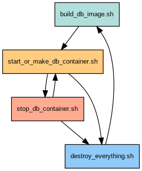

# Rates Webservice

[](https://github.com/habedi/rates-webservice/actions/workflows/tests.yml)
[](https://github.com/habedi/rates-webservice)

This repository includes my solution for the technical task described [here](assets/task_files/README.md). The task
involves developing a webservice
to get the average daily sea transportation prices between ports and geographical regions between two
dates. I developed
this solution using the [Flask web framework](https://flask.palletsprojects.com)
and other related libraries (see [pyproject.toml](pyproject.toml) for more details). I
used [Poetry](https://python-poetry.org/) for dependency management, which you most likely need to
run the webservice without much hassle.

The structure of the repository is as follows:

- [api](api): The main Python package that includes the code for the webservice.
- [assets](assets): Contains the SQL scripts for updating and optimising the database, a few useful Bash scripts for
  managing the lifecycle of the database Docker container, and a few scripts, including sample requests for the web
  service.
  It also includes the task's original
  files, such as its description, the original database dump and its updated version.
- [tests](tests): Contains the unittests.
- [start_service.sh](start_service.sh): A Bash script to serve the webservice using [Gunicorn](https://gunicorn.org).

The rest of this README file includes the instructions on how to set up the webservice, how to set up the
database in a Docker container, how to start the webservice, run the tests, etc.

## Installing Poetry

As I mentioned, to run the webservice, you need to have Poetry installed, which you can do using pip.

```bash
pip install poetry
```

When Poetry's installation is finished, run the following command in the shell in the root folder of this repository to
install
the dependencies and create a virtual environment for the project.

```bash
poetry install
```

After that, enter the Poetry environment by invoking the poetry shell command.

```bash
poetry shell
```

Now, everything should be set up and ready to start the webservice. From now on, I assume that you're running
commands
from within the Poetry environment.

## Database Setup

This section includes instructions on how to set up the database and how to start the database server in a Docker
container.

### Using the Updated Database Dump

I added a few functions and one index to the database. These functions do most of the work when the service is being
invoked.

1. [is_valid_port function](assets/sql/is_valid_port.sql): Given a port code, this function checks if the port code is
   valid
   by checking if the port code exists in the database.
2. [is_valid_region function](assets/sql/is_valid_region.sql): Given a region slug, this function checks if the slug is
   valid by checking if the region slug exists in the database.
3. [get_region_ports function](assets/sql/get_region_ports.sql): Given a region slug, this function returns all the
   ports
   in the region or (if a region has sub-regions) its sub-regions. 
4. [get_average_daily_prices function](assets/sql/get_average_daily_prices.sql): Given a start date, end date, a list of
   source port codes, a list of destination port codes, and a count limit (which is three based on the requirements of
   this
   task), this function returns the average daily prices for the given source and destination port sets within the given
   date range according to the way it was asked in the task description (see [here](assets/task_files/README.md)).
5. [An index on the day column](assets/sql/create_index.sql): A B-tree index on column `day` of the
   table `prices`. Because the query in the function `get_average_daily_prices` uses the `day` column to filter the
   results,
   if the
   prices table is large, having an index will be very useful for speeding up the queries.

I created an updated database dump with the functions and the added index. It's
available [here](assets/task_files/rates_optimised.sql).

The database is named `xenetadb`, and you can connect to it using username `hassan` and password `password`. (If you
import the `rate.sql`, you must add the functions and the index yourself. The SQL files for that are
stored [here](assets/sql)).

### Starting the Database Server in a Docker Container

You can use the Bash scripts available in [here](assets/useful_scripts/db_setup) to build the Docker image used for
making the container hosting the database services.

You can run the following command to build the database Docker image (named `xenetadb_image`):

```bash
bash assets/useful_scripts/db_setup/build_db_image.sh
```

To create and also (re-)start container hosting the database services (named `xenetadb_container`) run, you can use the
following script:

```bash
bash assets/useful_scripts/db_setup/start_or_make_db_container.sh
```

To stop the container, you can use this script:

```bash
bash assets/useful_scripts/db_setup/stop_db_container.sh
```

You can run `start_or_make_db_container` and `stop_db_container` to start and stop the database container as many times
as you need. Also, the data in the database will be preserved when the container is stopped.

Finally, to stop and delete the container, image, and also database data, you can run the following
command:

```bash
bash assets/useful_scripts/db_setup/destroy_everything.sh
```

Please note that you'll need to have built the image before creating and starting the container.

The figure below shows the order in which the scripts can be executed to manage the lifecycle of the database Docker
container.



By the way, I'm assuming that you have Docker installed on your machine, and you have the necessary permissions to run
Docker commands.

## Starting the Webservice

You can run the following command in the project's root directory to start the rates webservice.

```bash
bash start_service.sh
```

## Starting Everything

If you want to start the database container and run the webservice for the first time, you can follow the steps below:

#### Step1: Cloning the Repository and Setting Up Poetry Environment

```bash
# Clone the repository
git clone --depth=1 https://github.com/habedi/rates-webservice.git

# Change the directory
cd rates-webservice

# Install the dependencies
sudo apt install python3-poetry -y && poetry install

# Enter the Poetry environment
poetry shell
````

#### Step 2: Starting the Database and the Webservice

```bash
# Build the database image
bash assets/useful_scripts/db_setup/build_db_image.sh

# Start the database container
bash assets/useful_scripts/db_setup/start_or_make_db_container.sh

## Stop the database container
# bash assets/useful_scripts/db_setup/stop_db_container.sh

# Start the webservice
bash start_service.sh

## Destroy the container, image, and the data (database state)
# bash assets/useful_scripts/db_setup/destroy_everything.sh
```

By the way, I'm assuming you're running the commands on a Debian-based OS like Debian itself, Ubuntu, or Mint.

## Miscellaneous

This section includes some miscellaneous information, including how to interact with the webservice, how to run the
tests,
etc.

### The API Documentation

The API has the endpoint `/rates`, which accepts four query parameters:

1. `date_from`: The start date of the date range in the format `YYYY-MM-DD`.
2. `date_to`: The end date of the date range in the format `YYYY-MM-DD`.
3. `origin`: The origin port code or region slug.
4. `destination`: The destination port code or region slug.

The behaviour of the webservice is as described in the task description
available [here](assets/task_files/README.md).

The task description didn't explicitly mention it, but I assumed that the port codes and region slugs match the
following regex pattern: `^[a-zA-Z0-9_]+$` based on the values in the `ports.code` and `regions.slug` columns in the database. So, if the origin or destination parameters don't match this pattern, the webservice will return an error message.

Please note that if the origin and destination have valid values but neither of the values exists in the database, an empty list (`[]`) will be returned by the web service.

### Sample Requests

I prepared a few sample Bash scripts to show how you can interact with the webservice. You can find them in
[here](assets/useful_scripts/example_invocations). Scripts are organised in two folders: `bad` and `good`. The scripts
in the `good` folder are expected to return results, while those in the `bad` folder are expected to return errors. To run
the scripts, you need to have [HTTPie](https://httpie.io) installed on your machine.

An example of a `good` script
is [example_2_port_to_region](assets/useful_scripts/example_invocations/good/example_2_port_to_region.sh)
which looks like this:

```bash
#!/bin/bash

# Loading the environment variables
source .env

# Set default values if the environment variables are not set
FLASK_HOST=${FLASK_HOST:-localhost}
FLASK_PORT=${FLASK_PORT:-5000}

# Example for port to region
# Sending a request using HTTPie
url="http://$FLASK_HOST:$FLASK_PORT/rates?date_from=2016-01-01&date_to=2016-01-10&origin=CNSGH&destination=north_europe_main"
echo "Invocation of the rates webservice with URL: $url"
http GET "$url"
```

which must return the following values:

```json
[
  {
    "average_price": 1112,
    "day": "2016-01-01"
  },
  {
    "average_price": 1112,
    "day": "2016-01-02"
  },
  {
    "average_price": null,
    "day": "2016-01-03"
  },
  {
    "average_price": null,
    "day": "2016-01-04"
  },
  {
    "average_price": 1142,
    "day": "2016-01-05"
  },
  {
    "average_price": 1142,
    "day": "2016-01-06"
  },
  {
    "average_price": 1137,
    "day": "2016-01-07"
  },
  {
    "average_price": 1124,
    "day": "2016-01-08"
  },
  {
    "average_price": 1124,
    "day": "2016-01-09"
  },
  {
    "average_price": 1124,
    "day": "2016-01-10"
  }
]
```

An example of a script in the `bad` category
is [example_2_bad_origin_1](assets/useful_scripts/example_invocations/bad/example_2_bad_origin_1.sh), which includes the following code:

```bash
#!/bin/bash

# Loading the environment variables
source .env

# Set default values if the environment variables are not set
FLASK_HOST=${FLASK_HOST:-localhost}
FLASK_PORT=${FLASK_PORT:-5000}

# Example for port to port
# Sending a request using HTTPie
url="http://$FLASK_HOST:$FLASK_PORT/rates?date_from=2016-01-01&date_to=2016-01-10&origin=C@NSGH&destination=EETLL"
echo "Invocation of the rates webservice with URL: $url"
http GET "$url"
```

which should return something like the following value (with debugging enabled, which is when `FLASK_DEBUG=True` in
the [.env](.env) file):

```json
{
    "error": "1 validation error for PortAndRegionValidator\nparam\n  String should match pattern '^[a-zA-Z0-9_]+$' [type=string_pattern_mismatch, input_value='C@NSGH', input_type=str]\n    For further information visit https://errors.pydantic.dev/2.6/v/string_pattern_mismatch"
}
```

and when debugging is disabled, it should return this:

```json
{
  "error": "An error occurred during processing your request. That's all we know."
}
```

### The ENV File

I used an environment file ([.env](.env)) to store the environment variables. It mainly includes the variables that are
used by
Docker, Flask, and Gunicorn. I think their names are self-explanatory. You can change the values of most of these
variables to
suit your needs.

### Running the Tests

You can run the unittests (with the code coverage report being printed out to the console) using the following command:

```bash
poetry run pytest tests/ -v --cov=api 
```

## TODO

Here are some of the things that I think can be improved:

- [x] Complete the documentation (mainly this README file).
- [x] Add better error handling.
- [x] Add more descriptive error messages (for when debugging is disabled).
- [x] Add logging to the webservice to make it easier to debug.
- [ ] Add more tests, especially for testing the database functions. Maybe use an embedded database
  like SQLite populated with the data from the `rates.sql` for testing.
- [ ] Add a Dockerfile to build an image for the webservice to make it easier to deploy the webservice everywhere.

## The License

Most of the files in this repository are available under [MIT license](LICENSE) except the files from the original task's
description, stored in [here](assets/task_files).
